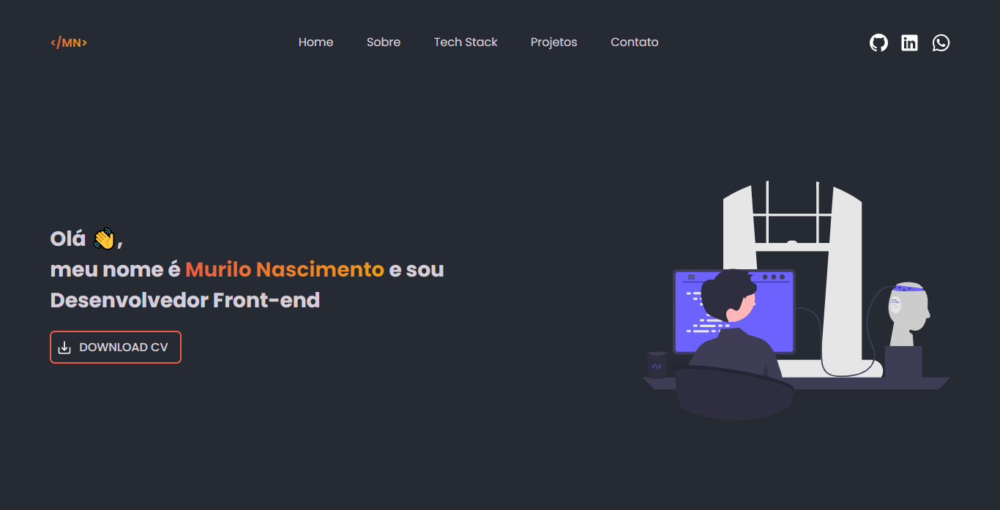

# Portfolio

Este é o meu portfólio pessoal, criado usando React, React Router Dom e Styled Components. Aqui, apresento informações sobre mim, meus projetos, habilidades e experiências profissionais.

## Tecnologias Utilizadas

- React
- React Router Dom
- Styled Components

## Como Iniciar o Projeto

Para iniciar o projeto em sua máquina local, siga os passos abaixo:

1. Faça o download ou clone o repositório em seu computador.
2. Abra o terminal e navegue até o diretório do projeto.
3. Execute o comando `npm install` para instalar as dependências do projeto.
4. Execute o comando `npm run dev` para iniciar o servidor de desenvolvimento.

O aplicativo será iniciado em http://localhost:3000.

## Estrutura do Projeto

A estrutura do projeto é dividida em pastas de acordo com suas funções, como:

- `src`: Contém todos os arquivos do projeto.
- `src/components`: Contém todos os componentes do projeto.
- `src/pages`: Contém todas as páginas do projeto.
- `src/styles`: Contém todos os estilos do projeto.

## Como Contribuir

Contribuições são sempre bem-vindas! Siga os passos abaixo para contribuir para este projeto:

1. Faça um fork deste repositório.
2. Crie uma branch com suas alterações: `git checkout -b minha-branch`
3. Faça suas alterações e faça commit das mesmas: `git commit -m 'Minha Alteração'`
4. Envie suas alterações para o repositório: `git push origin minha-branch`
5. Crie um pull request para este repositório.

## Layout

## Licença

Este projeto está sob a Licença MIT. Veja o arquivo [LICENSE](LICENSE) para mais detalhes.
