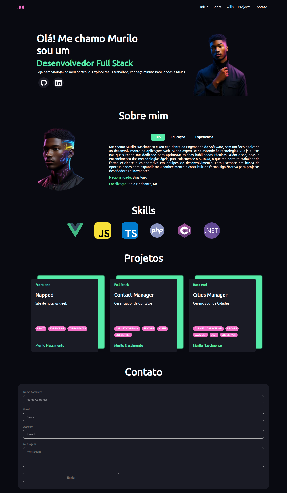

# Portfólio

Este é o repositório do meu portfólio desenvolvido utilizando Vue.js e TypeScript.

## Descrição

Meu portfólio é uma aplicação web desenvolvida para mostrar meus projetos, habilidades e experiências como desenvolvedor FullStack.

## Tecnologias Utilizadas

- Vue.js
- TypeScript
- Vue Router
- CSS
- Radix Vue
- EmailJS

## Estrutura do Projeto

- `/src`: Contém o código fonte da aplicação Vue.js.
  - `/assets`: Recursos estáticos como imagens e fontes.
  - `/components`: Componentes reutilizáveis da aplicação.
  - `/views`: Componentes das páginas da aplicação.
  - `/router`: Configurações de rotas.
- `/public`: Arquivos estáticos que serão servidos diretamente (índice HTML, imagens, etc.).
- `tsconfig.json`: Configurações TypeScript.
- `package.json`: Lista de dependências e scripts de construção e execução.
- `README.md`: Este arquivo de documentação.

